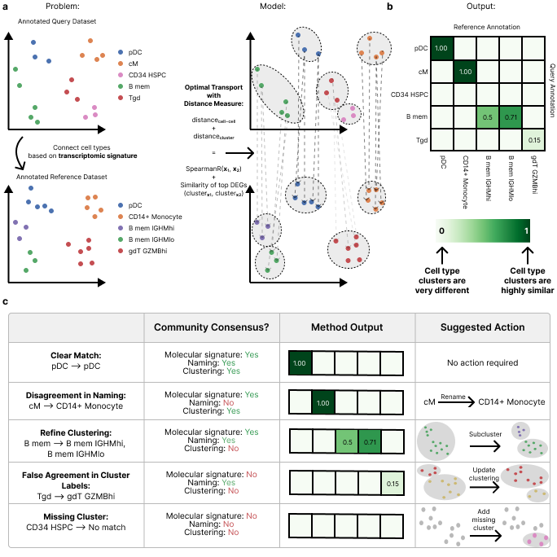
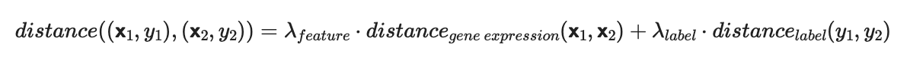
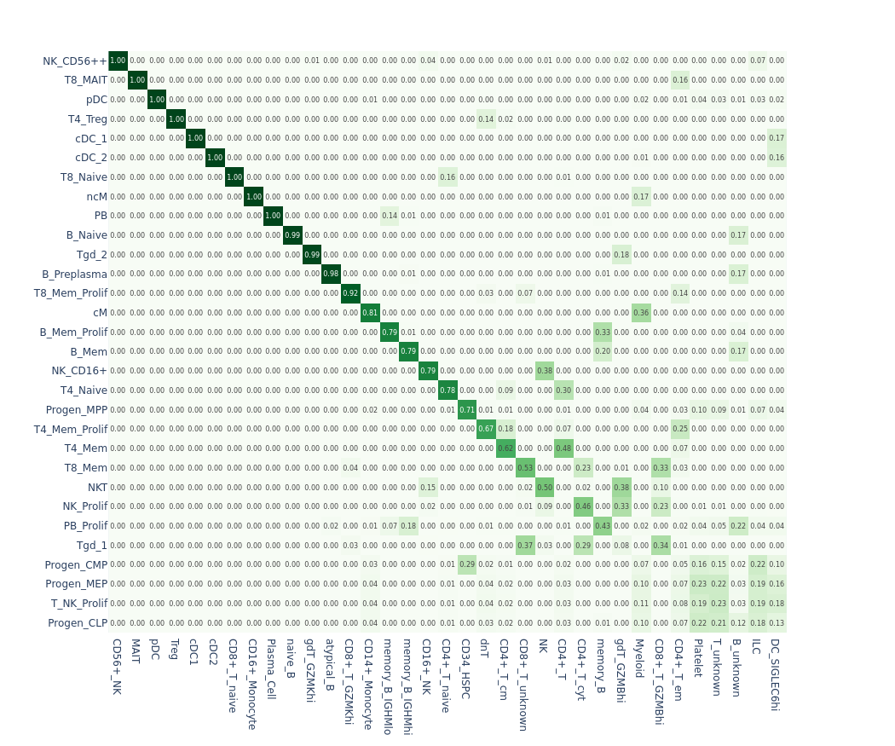
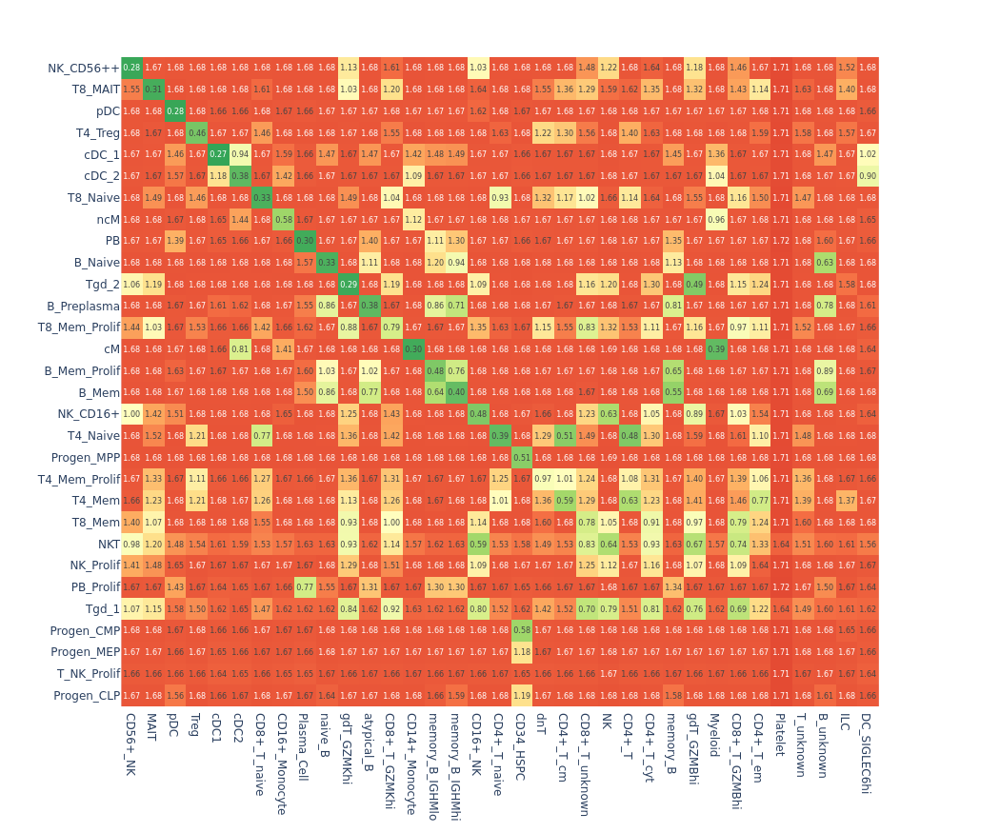

# Introduction to pairOT

## What is pairOT?

pairOT is a Python package to align cell annotations between single-cell RNA-seq datasets. Given the cell-type
annotations of two datasets, pairOT shows the similarity of the respective cell type clusters. Hence, pairOT can be
used to identify similar cell types and cell states between the two studies and to show to the user where there might be
disagreements between cell annotations of the two datasets.

## How does it work?

pairOT aims to “align” (or to “connect”) cell-type labels between two scRNA-seq datasets
(query + reference dataset), suggesting similar clusters or potential matches against the reference dataset for each
cell type in the query dataset solely based on the underlying transcriptomic signatures. To achieve this task, we model
each dataset as a point cloud, meaning each data point or cell is associated with a gene expression vector (𝘅) and a
cluster / cell-type label (y). Notably, the clustering or grouping information of individual cells uniformly annotated,
not the associated string labels, is provided by the cell-type label y. At its core, pairOT uses optimal transport to
connect the point cloud distribution of the query dataset with the point cloud from the reference dataset; thus, the
method considers the global structure of the data, compared to just finding the closest neighbors in the reference dataset.
The distance between a cell in the query dataset (described by the multi-dimensional gene expression vector 𝘅₁ and
cluster label y₁) and a cell in the reference dataset (described by the multi-dimensional gene expression vector
𝘅₂ and cluster label y₂) is split into two parts. The distance measure (also known as the “transport cost”) is the
sum between the distance in gene expression space and the distance in label space:

## What does it produce?
pairOT produces two key outputs:
  * **Similarity Matrix**: Showing the closest matching (considering the global structure of the data) cell-type in the reference dataset for each cell-type in the query dataset.

  * **Distance Matrix**: Showing the similarity/distance between the cell-type clusters of the query and reference dataset.

## What are the advantages over existing methods?
We improve over existing methods in two key ways:
  1. Using a considerably more predictive distance measure: By including information of differentially expressed genes in the distance measure we're able to resolve differences between fine-grained cell-type subtypes.
  2. Considering the global structure of the data: By using optimal transport we consider the global structure of the data and thus are able to provide more trustworthy and human interpretable similarity estimates.
